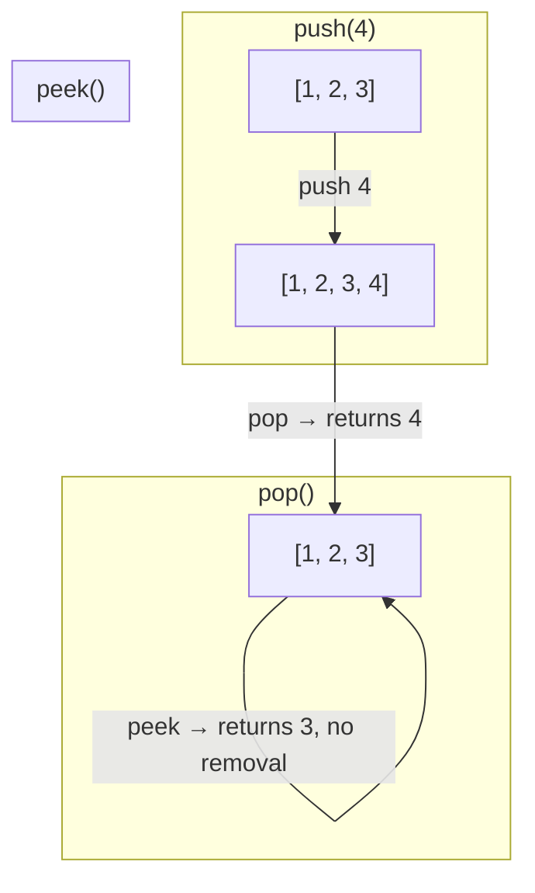
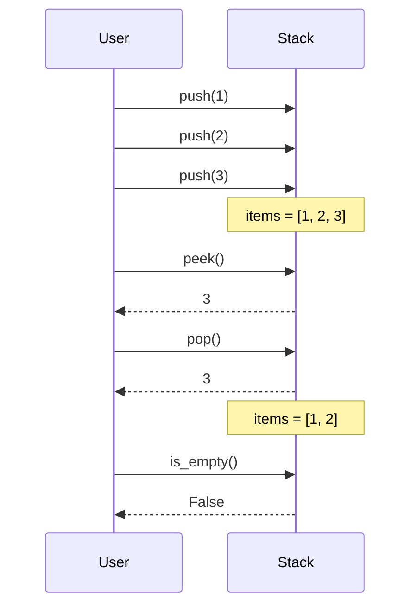

## 📖 Overview

A **Stack** is a linear data structure that follows the **LIFO** principle — the last element added is the first one removed. Think of a stack of plates: you add plates to the top, and you remove plates from the top.

This implementation wraps Python's built-in `list` to provide a clean, well-defined stack interface with proper error handling for edge cases like popping from an empty stack.

---

## 🖼️ How a Stack Works



**Visualizing the internal list:**

```
        ┌───┐  ← top (last in, first out)
        │ 3 │
        ├───┤
        │ 2 │
        ├───┤
        │ 1 │
        └───┘
        items = [1, 2, 3]
```

---

## ⚙️ Operations Sequence



---

## 🧩 Class Reference

| Method        | Description                                  | Returns              | Raises                          |
|---------------|-----------------------------------------------|-----------------------|----------------------------------|
| `push(item)`  | Adds `item` to the top of the stack           | `None`                | —                                |
| `pop()`       | Removes and returns the top item              | Top item              | `IndexError` if stack is empty  |
| `peek()`      | Returns the top item without removing it      | Top item              | `IndexError` if stack is empty  |
| `is_empty()`  | Checks whether the stack has no elements      | `bool`                | —                                |
| `size()`      | Returns the number of elements in the stack   | `int`                 | —                                |
| `__str__()`   | Returns a string representation of the stack  | `str`                 | —                                |

### ⏱️ Time Complexity

| Operation   | Complexity |
|-------------|:----------:|
| `push`      | O(1)       |
| `pop`       | O(1)       |
| `peek`      | O(1)       |
| `is_empty`  | O(1)       |
| `size`      | O(1)       |

---

## 🚀 Usage

```python
from stack import Stack

stack = Stack()
stack.push(1)
stack.push(2)
stack.push(3)

print("Stack:", stack)          # Stack: [1, 2, 3]
print("Top element:", stack.peek())  # Top element: 3
print("Popped:", stack.pop())        # Popped: 3
print("Stack after pop:", stack)     # Stack after pop: [1, 2]
print("Is empty?", stack.is_empty()) # Is empty? False
```

**Sample Output:**

```
Stack: [1, 2, 3]
Top element: 3
Popped: 3
Stack after pop: [1, 2]
Is empty? False
```

---

## ⚠️ Error Handling

Calling `pop()` or `peek()` on an empty stack raises an `IndexError`:

```python
empty_stack = Stack()
empty_stack.pop()   # IndexError: pop from empty stack
empty_stack.peek()  # IndexError: peek from empty stack
```

---

## 💡 Real-World Use Cases

- **Undo/Redo** functionality in text editors
- **Function call stack** in programming language runtimes
- **Expression evaluation** (balanced parentheses, postfix/infix conversion)
- **Browser history** (back button navigation)
- **Depth-First Search (DFS)** in graph/tree traversal
- **Backtracking algorithms**

---

## 📁 Project Structure

```
.
├── stack.py       # Stack class implementation
└── README.md      # Documentation (this file)
```

---