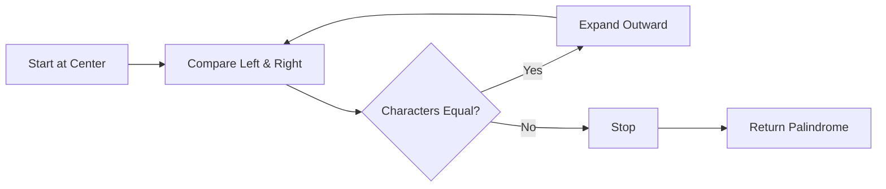
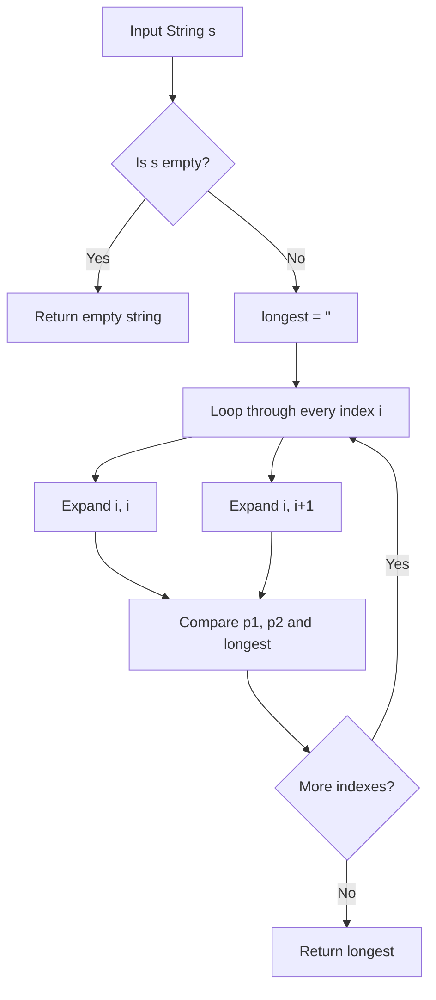

# 🔥 Longest Palindromic Substring

> Find the **longest palindromic substring** using the **Center Expansion** technique.

---

## 🚀 Example

```python
s = "banana"
```

### Output

```text
anana
```

Because `"anana"` reads the same forward and backward.

```text
a n a n a
↑       ↑
Same forward and backward
```

---

## 🧠 What is a Palindrome?

A **palindrome** is a string that reads the same from left to right and right to left.

|   String  | Palindrome? |
| :-------: | :---------: |
|  `madam`  |      ✅      |
| `racecar` |      ✅      |
|   `aba`   |      ✅      |
|   `abba`  |      ✅      |
|  `hello`  |      ❌      |
|  `python` |      ❌      |

---

# 💡 Core Idea

Instead of checking every possible substring, we treat every character as a possible **center**.

Then we expand outward while both characters are equal.



---

# 🎯 Two Types of Palindromes

There are two possible centers.

## 1️⃣ Odd-Length Palindrome

The center is **one character**.

Example:

```text
    a
   aba
  anana
```

For:

```text
banana
   ↑
 center
```

we call:

```python
expand_around_center(i, i)
```

---

## 2️⃣ Even-Length Palindrome

The center is **between two characters**.

Example:

```text
abba
 ↑↑
center
```

We call:

```python
expand_around_center(i, i + 1)
```

---

# 🔄 Algorithm



---

# 🧩 Complete Code

```python
def longest_palindrome(s: str) -> str:
    """Find the longest palindromic substring using center expansion."""

    if not s:
        return ""

    def expand_around_center(left: int, right: int) -> str:
        while left >= 0 and right < len(s) and s[left] == s[right]:
            left -= 1
            right += 1

        return s[left + 1 : right]

    longest = ""

    for i in range(len(s)):

        # Odd-length palindrome
        p1 = expand_around_center(i, i)

        # Even-length palindrome
        p2 = expand_around_center(i, i + 1)

        longest = max(longest, p1, p2, key=len)

    return longest


if __name__ == "__main__":

    s = "banana"

    print(longest_palindrome(s))
```

---

# 🔍 Function Breakdown

## 1. Check Empty String

```python
if not s:
    return ""
```

If the input is empty:

```text
""
```

return immediately.

---

## 2. Expand Around Center

```python
def expand_around_center(left: int, right: int) -> str:
```

This function receives two indexes:

```text
left       right
 ↓           ↓
 b a n a n a
```

It checks:

```python
s[left] == s[right]
```

If they are equal, expand:

```python
left -= 1
right += 1
```

---

# 📌 Example of Expansion

For:

```text
banana
```

Start from the middle:

```text
b a n a n a
      ↑
      a
```

Compare outward:

```text
b a n a n a
  ↑     ↑
  n     n
```

Then:

```text
b a n a n a
↑         ↑
b         a
```

`b != a`, so the expansion stops.

The palindrome found is:

```text
anana
```

---

# 🧮 Complete Iteration

Input:

```text
banana
```

| `i` | Character |   Odd `p1`  | Even `p2` |  `longest`  |
| :-: | :-------: | :---------: | :-------: | :---------: |
| `0` |    `b`    |     `b`     |    `""`   |     `b`     |
| `1` |    `a`    |     `a`     |    `""`   |     `b`     |
| `2` |    `n`    |    `ana`    |    `""`   |    `ana`    |
| `3` |    `a`    | **`anana`** |    `""`   | **`anana`** |
| `4` |    `n`    |    `ana`    |    `""`   |   `anana`   |
| `5` |    `a`    |     `a`     |    `""`   |   `anana`   |

---

# 🔎 Detailed Walkthrough

## 🟢 i = 0

```text
b a n a n a
↑
i=0
```

### Odd

```python
expand_around_center(0, 0)
```

```text
b == b ✅
```

Result:

```text
p1 = "b"
```

### Even

```python
expand_around_center(0, 1)
```

```text
b != a ❌
```

Result:

```text
p2 = ""
```

### Longest

```text
longest = "b"
```

---

## 🟢 i = 1

```text
b a n a n a
  ↑
 i=1
```

### Odd

```text
a == a ✅
b != n ❌
```

Result:

```text
p1 = "a"
```

### Even

```text
a != n ❌
```

Result:

```text
p2 = ""
```

### Longest

```text
longest = "b"
```

---

## 🟢 i = 2

```text
b a n a n a
    ↑
   i=2
```

### Odd

```text
n == n ✅
a == a ✅
b != n ❌
```

Result:

```text
p1 = "ana"
```

### Even

```text
n != a ❌
```

Result:

```text
p2 = ""
```

### Longest

```text
longest = "ana"
```

---

## ⭐ i = 3

```text
b a n a n a
      ↑
     i=3
```

### Odd

Start:

```text
a == a ✅
```

Expand:

```text
n == n ✅
```

Expand:

```text
a == a ✅
```

Expand again:

```text
outside the string ❌
```

Therefore:

```text
p1 = "anana"
```

### Even

```text
a != n ❌
```

Therefore:

```text
p2 = ""
```

### Longest

```python
longest = max("ana", "anana", "", key=len)
```

Result:

```text
longest = "anana"
```

---

## 🟢 i = 4

```text
b a n a n a
        ↑
       i=4
```

### Odd

```text
n == n ✅
a == a ✅
```

Result:

```text
p1 = "ana"
```

### Even

```text
n != a ❌
```

Result:

```text
p2 = ""
```

`"anana"` is still longer.

```text
longest = "anana"
```

---

## 🟢 i = 5

```text
b a n a n a
          ↑
         i=5
```

### Odd

```text
a == a ✅
```

Result:

```text
p1 = "a"
```

### Even

The right pointer is outside the string:

```text
right = 6
```

Therefore:

```text
p2 = ""
```

`"anana"` remains the longest.

---

# 🏁 Final Result

```text
Input:
banana

        ↓

Output:
anana
```

Visualization:

```text
b a n a n a
    └─────┘
     anana
```

---

# ⚙️ Complexity

| Complexity |  Value  |
| :--------: | :-----: |
|   ⏱️ Time  | `O(n²)` |
|  💾 Space  |  `O(n)` |

### Why `O(n²)`?

There are `n` possible centers.

For each center, we may expand up to `n` characters.

```text
n centers × n expansion
        ↓
      O(n²)
```

---

# 🆚 Alternative Approaches

|       Approach       |     Time    |    Space   | Difficulty |
| :------------------: | :---------: | :--------: | :--------: |
|      Brute Force     |   `O(n³)`   |   `O(n)`   |   🟢 Easy  |
|  Dynamic Programming |   `O(n²)`   |   `O(n²)`  |  🟡 Medium |
| **Center Expansion** | **`O(n²)`** | **`O(n)`** |   🟢 Easy  |
| Manacher's Algorithm |    `O(n)`   |   `O(n)`   |   🔴 Hard  |

For learning DSA, **Center Expansion is a very good approach** because it is simple and efficient enough for most problems.

---

# 🧠 Remember

The most important part is:

```python
p1 = expand_around_center(i, i)
p2 = expand_around_center(i, i + 1)
```

Think:

```text
             Center
                ↓
       ┌────────┴────────┐
       ↓                 ↓
   Odd Length        Even Length
     (i, i)           (i, i+1)
       ↓                 ↓
   Expand ↔           Expand ↔
       └────────┬────────┘
                ↓
          Choose Longest
```

### ⭐ One-Line Concept

> **Try every possible center, expand outward, and keep the longest palindrome.**

---

# 📌 Key Takeaways

* 🔹 A palindrome reads the same forward and backward.
* 🔹 Every character can be an **odd palindrome center**.
* 🔹 Every gap between characters can be an **even palindrome center**.
* 🔹 Expand outward while characters match.
* 🔹 Keep the longest palindrome found.
* 🔹 Center Expansion takes **`O(n²)` time**.
* 🔹 It is much simpler than Manacher's Algorithm.

---

## 🏆 Result

```text
          banana
             ↓
      Center Expansion
             ↓
         "anana"
             ↓
       Longest Palindrome
```
